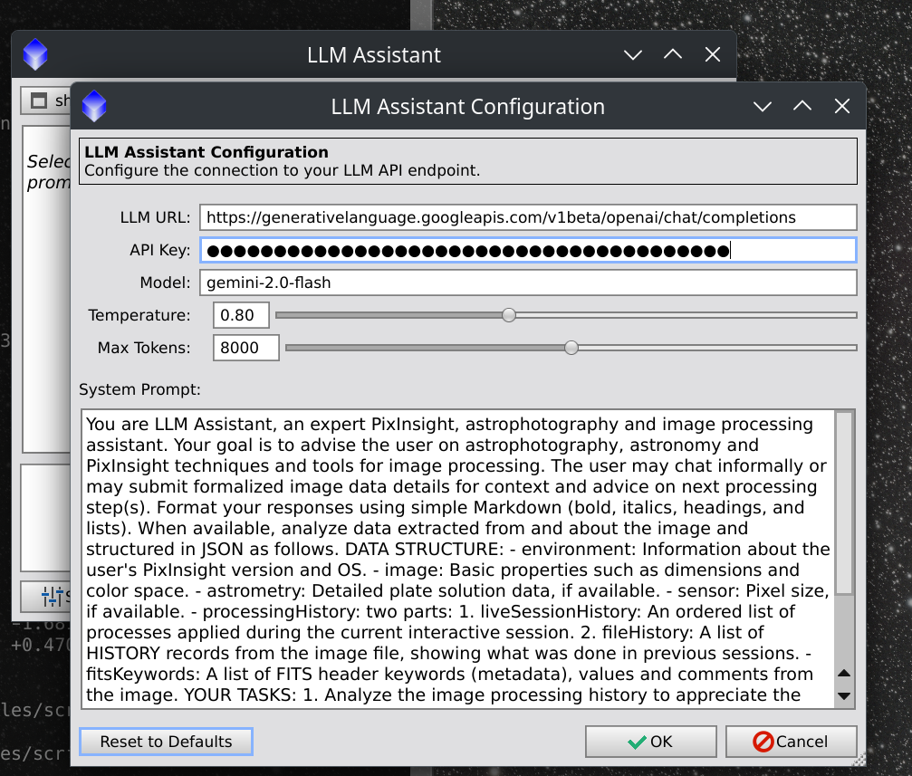

# LLM Assistant (for PixInsight)

)

**LLM Assistant for PixInsight** is a script that integrates a local or cloud-based Large Language Model (LLM) directly into your PixInsight workspace. It acts as an astrophotography processing assistant, aware of a selected image's specific data and metadata, to provide advice on next processing steps, help understand the image data, and generate descriptions of finished work.

Start getting data-driven recommendations tailored to *your* image, right inside PixInsight.

---

## Features

*   **Context-Aware Analysis:** The assistant doesn't give generic advice. It analyzes a profile of any selected image, including:
    *   **Live Processing History:** Understands the steps *just* taken in the current session.
    *   **Astrometric Data:** Knows what objects are in the image and at what image scale.
    *   **Image Properties:** Dimensions, color space, file path, and more.
    *   **FITS Header:** Any available FITS keyword data.
*   **Interactive Chat UI:** A modal (as required for PixInsight Scripts) dialog supporting conversation with an LLM Assistant.
*   **Expert Recommendations:** Asks the LLM to suggest the next logical processing steps based on a selected image's current state.
*   **Image Description Generation:** Select a finished image and ask the assistant to write a detailed description of the astronomical target and the processing workflow used to create it.
*   **Highly Configurable:** Easily configure connection to any OpenAI-compatible API.

*Here is a screenshot of the main chat UI, showing the image selection dropdown, the chat history, and the input box.*

---

## Requirements

1.  **PixInsight:** Version 1.8.9 or later is recommended.
2.  **An LLM Server (Local or Cloud):** You must have access to an LLM that provides an OpenAI-compatible API endpoint. This is a flexible requirement that can be met in several ways:
    *   **Local Servers (Recommended for privacy and no cost):**
        *   [LM Studio](https://lmstudio.ai/): An easy-to-use desktop app for running local models and serving an API endpoint locally.
        *   [llama.cpp](https://github.com/ggerganov/llama.cpp): A high-performance engine with an OpenAI-compatible server option for more advanced users.
    *   **Cloud Services (For powerful, cutting-edge models):**
        *   **Cloudflare AI Gateway:** A fantastic service to connect to models from Meta (Llama 3), Google, Qwen and more, which offers 10,000 "neurons" (around 40,000 tokens) free per day.
        *   **Google Gemini AI:** Use Google's latest Gemini models via their OpenAI-compatible endpoint.
        *   Currently, any other service that offers an OpenAI-compatible API or Cloudflare Gateway-compatible API.
3.  **An LLM Model:** A capable chat or instruction-tuned model. Models such as Llama 3.2 Instruct, Mixtral, Qwen 3, Gemini Flash ad Pro, OpenAI, Claude and variants of Mistral are excellent choices, able to identify astronomical targets by celestial coordinates and knowledgeable to various degrees about PixInsight and astrophotography processing.

---

## Installation

1.  **Download the Script:** Download the `main` branch of this repository as a `.zip` file and extract it to a memorable location.
2.  **Open PixInsight.**
3.  Go to the main menu and select `Script > Feature Scripts...`.
4.  In the Feature Scripts dialog, click the **"Add"** button.
5.  Navigate to the location where you extracted the repository and select the **`pi2llm`** folder (the folder that contains `pi2llm-main.js` and the `lib` sub-folder).
6.  Click **"Done"**.

The LLM Assistant should appear under the `Script > Utilities` menu as `LLM Assistant`.

---

## First-Time Configuration

Before using the assistant, configure it to connect to a live LLM API endpoint, local or remote.

1.  Go to `Script > Utilities > LLM Assistant` the first time.
2.  The configuration dialog will open the first time.

    *Here is a screenshot of the configuration dialog, showing the URL, API Key, and Model fields.*
    

3.  **LLM URL:** Enter the full URL of an LLM's chat completions API endpoint.
    *   For **LM Studio**, this is `http://127.0.0.1:4321/v1/chat/completions`.
    *   For a **Cloudflare AI Gateway**, it will look like `https://gateway.ai.cloudflare.com/v1/${ACCOUNT_ID_STRING}/${API_GATEWAY}/workers-ai/${MODEL_PATH}` where the `model` is specified in the URL.
    *   For a **Google AI API**, the URL will look like `https://generativelanguage.googleapis.com/v1beta/openai/chat/completions` and the `model` is specified as a separate configuration value.
4.  **API Key:** For local servers, you can typically leave the default "no-key". For cloud services, enter your API token for your account's authentication.
5.  **Model:** This field is often required by cloud services to specify which model to use, though some vendors put the model name in the URL. It can be left blank for local LLM servers.
    *   For a **Cloudflare AI Gateway**, an example might be `@cf/meta/llama-4-scout-17b-16e-instruct`.
    *   For **Google AI**, an example might be `gemini-2.0-flash`.
    *   For local servers like `llama.cpp` where you only load one model, this field can often be left blank.
6.  **System Prompt:** A default system prompt is provided and can be customized to change the assistant's behavior.
7.  **Temperature / Max Tokens:** These control the "creativity" and length of the LLM's responses. The defaults are a good starting point.
8.  Click **"OK"** to save the script settings.

---

## How to Use the LLM Assistant

Once configured, using the assistant is a simple interactive process.  You may begin chatting to the LLM directly through the input text area, using Ctrl+Enter as a keyboard shortcut to Send, or use the Send button.

1.  **Open one or more images** in your PixInsight workspace. For best results, use images that have been plate-solved with astrometric data and have been saved with processing history and/or XISF or FITS headers.
2.  Go to `Script > Utilities > LLM Assistant` to launch the main tool.
3.  The chat window will appear.  The first time it is run it will display its Configuration aka Settings dialog. See the Configuration section ^ if needed.
4.  **Select a Target Image:** Use the dropdown menu at the top left of the window to choose an open image to work on.
5.  **Analyze:** Click the **"Analyze Selected Image"** button. The script will gather details about the image and send them to the LLM. **NOTE: at no time is an image sent to the LLM.  That feature may be implemented in a future version of the script, if a user wants to opt in to submitting image bytes to a Multimodal LLM or Vision Language Model for analysis.**
6.  **Chat** The first response from the LLM will appear. You can now have a conversation:
    *   Ask for recommendations: `"What should I do next?"`
    *   Ask for clarification: `"Explain what DynamicBackgroundExtraction does."`
    *   Ask for a description: `"Please write a description for this image for AstroBin."`

*Here is a screenshot showing the data sent to the LLM at the top, and part of the response from Alibaba's Qwen LLM model `Qwen3-4b-2507` running locally on LMStudio 3.24.*

### Key Features of the Chat Window

*   **New Chat:** Button resets the conversation and clears history.
*   **Settings:** Opens the configuration dialog at any time.
*   **Export History:** Saves the current conversation to a `.txt` or `.json` file.

---

## Feedback and Contributions

This is a new tool, and I welcome your feedback! If you encounter bugs, have ideas for new features, or would like to contribute, please [open an issue](https://github.com/scottstirling/pi2llm/issues) on the GitHub repository.  Thank you

