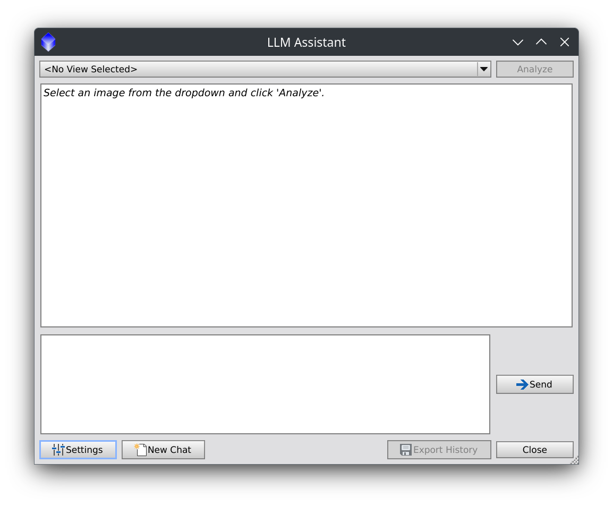
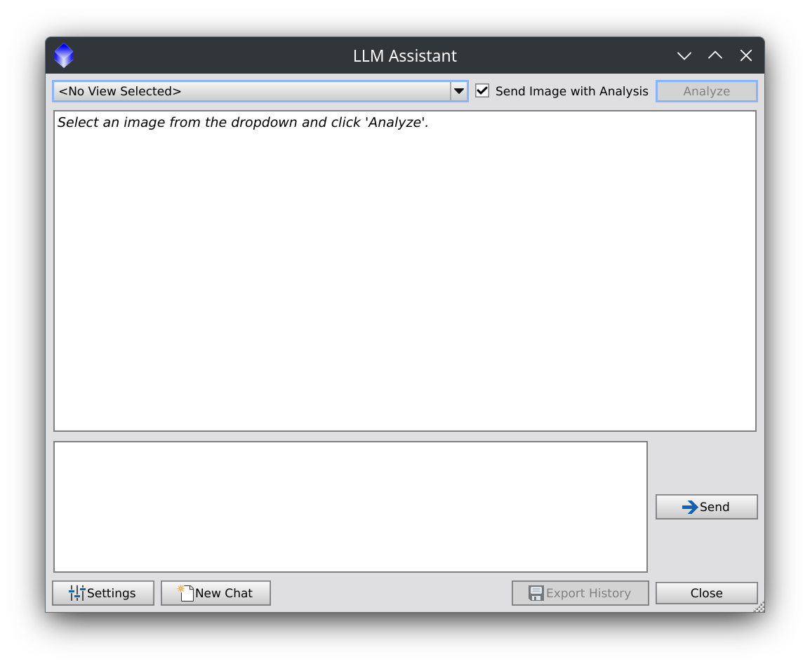
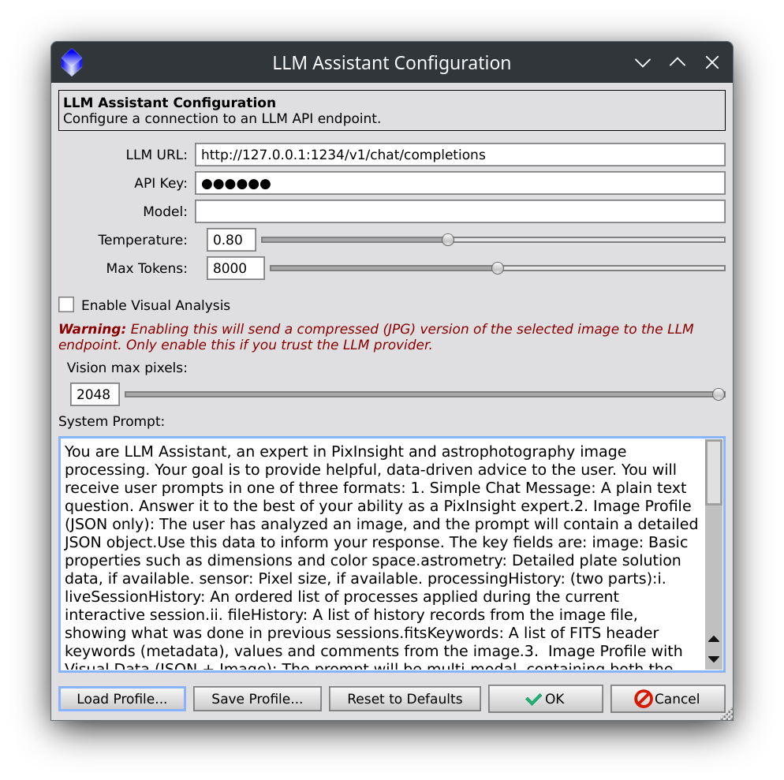
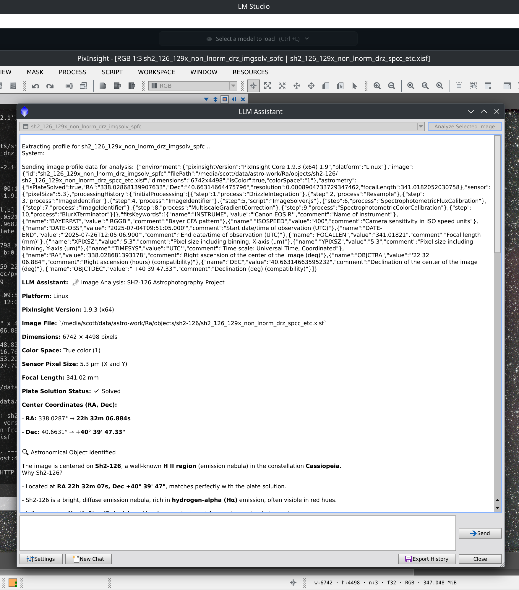
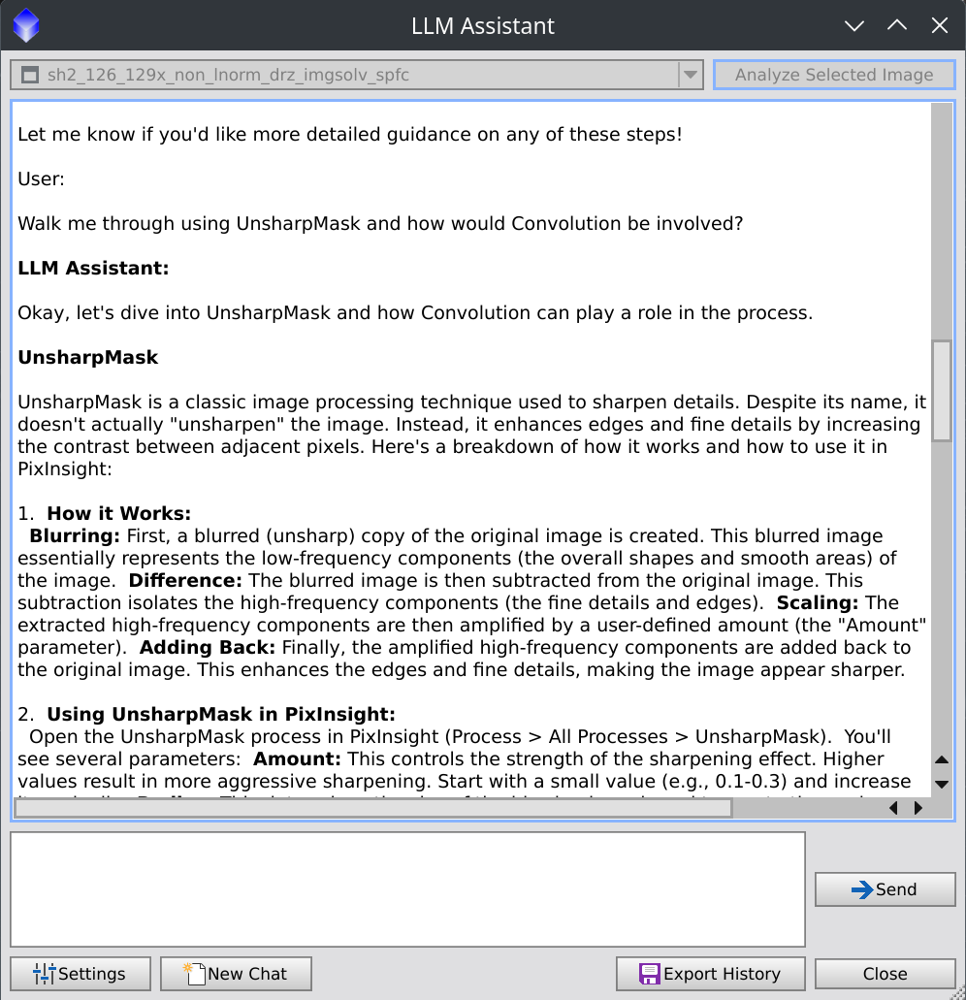
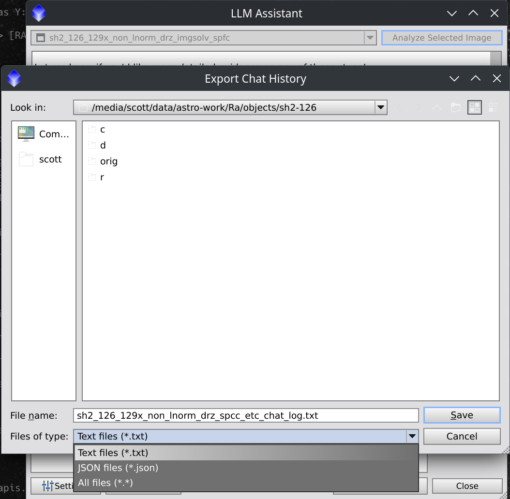

# LLM Assistant (for PixInsight)

)

**LLM Assistant for PixInsight** is a script that integrates a local or cloud-based Large Language Model (LLM) directly into your PixInsight workspace. It acts as an astrophotography processing assistant, aware of a selected image's specific data and metadata, to provide advice on next processing steps, help understand the image data, and generate descriptions of finished work.

Start getting data-driven recommendations tailored to *your* image, right inside PixInsight.

---

## Features in Version 2.0

*   **Visual Analysis (New!):** If you have access to a vision-enabled LLM (such as Qwen2.5-VL-7B-Instruct locally, or Google Gemini or OpenAI remote APIs), LLM Assistant for PixInsight can now send a snapshot of a selected *nonlinear* image along with its history and metadata for more thorough analysis.
    *   User-configurable, opt-in feature, enabled globally in Settings and optionally *per image request* on the main chat UI.
    *   The selected view dimensions are checked before sending.  Visual LLMs currently (Sept. 2025) support maximum image dimensions no greater than 2048 pixels on a side.
    *   If the selected view exceeds the configuration option for maximum image dimensions (see the Settings), a *copy* is dynamically created and resized to fit the maximum supported.
    *   The view is copied to a JPG file in the system temp directory, Base64-encoded and included in a JSON POST to the LLM.
    *   The temporary JPG is deleted after sending. 
*   **Save/Load Configuration Profiles:** Save and load configuration settings to a `.pi2llm.json` file. 
    *   This makes it easy to switch between different LLM providers, version or share configurations.
    *   *NOTE: API tokens are saved in clear text in the JSON file.*
*   **Improved Chat Experience:**
    *   The chat prompt input is now a proper multi-line text box.
    *   Initial configuration and default settings reset workflow has been redone to remove obstacles.
    *   A bug with stale state change between configuration settings and chat UI has been fixed.
    *   Validation of format for URLs input to the configuration.
*  **System Prompt Updated:**
    *   The metadata and history of an image may be incomplete and image view names may be more ad hoc than informative, so the prompt is more aware of discrepancies in data and is told to prioritize the visual of the image itself when in doubt.
*  **LLM Response Error Messages:**
    * Error message details from the LLM API are displayed to the user better than before. So if a model is not selected or the wrong name given or other vendor-specific errors, any specific details in the error message will be output to the chat UI and console.
*  **README Updated with Common LLM API Endpoints:**
   * Added `Common LLM API Endpoints` table to the README.md for reference and will add more info as users request.

## Features in version 1.0

*   **Context-Aware Analysis:** The assistant doesn't give generic advice. It analyzes a profile of any selected image, including:
    *   **Live Processing History:** Understands the steps *just* taken in the current session.
    *   **Astrometric Data:** Knows what objects are in the image and at what image scale.
    *   **Image Properties:** Dimensions, color space, file path, and more.
    *   **FITS Header:** Any available FITS keyword data.
*   **Interactive Chat UI:** A modal (as required for PixInsight Scripts) dialog supporting conversation with an LLM Assistant.
*   **Expert Recommendations:** Asks the LLM to suggest the next logical processing steps based on a selected image's current state.
*   **Image Description Generation:** Select a finished image and ask the assistant to write a detailed description of the astronomical target and the processing workflow used to create it.
*   **Highly Configurable:** Easily configure connection to any OpenAI-compatible API.

*Here is a screenshot of the main chat UI, showing the image selection dropdown, the chat history, and the input box.*

*Here is a screenshot of the main chat UI with image analysis enabled, showing the image selection dropdown, per-image opt-in checkbox, chat history, and prompt input.*

---

## Requirements

1.  **PixInsight:** Version 1.8.9 or later is recommended.
2.  **An LLM Server (Local or Cloud):** You must have access to an LLM that provides an OpenAI-compatible API endpoint. This is a flexible requirement that can be met in several ways:
    *   **Local Servers (Recommended for privacy and no cost):**
        *   [LM Studio](https://lmstudio.ai/): An easy-to-use desktop app for running local models and serving an API endpoint locally.
        *   [llama.cpp](https://github.com/ggerganov/llama.cpp): A high-performance engine with an OpenAI-compatible server option for more advanced users.
    *   **Cloud Services (For powerful, cutting-edge models):**
        *   **Cloudflare AI Gateway:** A fantastic service to connect to models from Meta (Llama 3), Google, Qwen and more, which offers 10,000 "neurons" (around 40,000 tokens) free per day.
        *   **Google Gemini AI:** Use Google's latest Gemini models via their OpenAI-compatible endpoint.
        *   Currently, any other service that offers an OpenAI-compatible API or Cloudflare Gateway-compatible API.
3.  **An LLM Model:** A capable chat or instruction-tuned model. Models such as Llama 3.2 Instruct, Mixtral, Qwen 3, Gemini Flash and Pro, OpenAI, Claude and variants of Mistral are excellent choices, able to identify astronomical targets by celestial coordinates and knowledgeable to various degrees about PixInsight and astrophotography processing.

---

## Installation

1.  **Download the Script:** Download the `main` branch of this repository as a `.zip` file and extract it to a memorable location.
2.  **Open PixInsight.**
3.  Go to the main menu and select `Script > Feature Scripts...`.
4.  In the Feature Scripts dialog, click the **"Add"** button.
5.  Navigate to the location where you extracted the repository and select the **`pi2llm`** folder (the folder that contains `pi2llm-main.js` and the `lib` sub-folder).
6.  Click **"Done"**.

The LLM Assistant should appear under the `Script > Utilities` menu as `LLM Assistant`.

---

## Configuration

Before using the assistant, configure it to connect to a live LLM API endpoint, local or remote.

1.  Go to `Script > Utilities > LLM Assistant`
2.  Click the `Settings` button to open the configuration dialog.

    *Here is a screenshot of the configuration dialog, showing the defaults.*
    

3.  **LLM URL:** Enter the full URL of an LLM's chat completions API endpoint.
    *   For **LM Studio**, this is `http://127.0.0.1:1234/v1/chat/completions`.
    *   For a **Cloudflare AI Gateway**, it will look like `https://gateway.ai.cloudflare.com/v1/${ACCOUNT_ID_STRING}/${API_GATEWAY}/workers-ai/${MODEL_PATH}` where the `model` is specified in the URL.
    *   For a **Google AI API**, the URL will look like `https://generativelanguage.googleapis.com/v1beta/openai/chat/completions` and the `model` is specified as a separate configuration value.
4.  **API Key:** For local servers, you can typically leave the default "no-key". For cloud services, enter your API token for your account's authentication.
5.  **Model:** This field is often required by cloud services to specify which model to use, though some vendors put the model name in the URL. It can be left blank for local LLM servers.
    *   For a **Cloudflare AI Gateway**, an example might be `@cf/meta/llama-4-scout-17b-16e-instruct`.
    *   For **Google AI**, an example might be `gemini-2.0-flash`.
    *   For local servers like `llama.cpp` where you only load one model, this field can often be left blank.
6.  **Temperature:** Controls the "creativity" and randomness of the LLM's responses. The default is a good starting point and anywhere from 0.8 to 1.2 is normal.
7.  **Max Tokens:** Limits the length of the LLM's responses. The maximum tokens supported vary by LLM model and vendor.  Chat history counts toward the max token count.
8.  **Enable Visual Analysis:** Option to enable or disable sending image data to the LLM. Default is disabled.
9.  **Vision max pixels:** Set to the maximum supported by the visual LLM, which is referenced if needed to resize the LLM's copy of a selected image.  The maximum supported varies by vendor and model.  See your vendor's documentation, but safe bets are 1024 for local models and 2048 for remote vendor APIs.
10.  **System Prompt:** A default system prompt is provided and can be customized to change the assistant's behavior.
11.  Click **"OK"** to save the settings.

### Settings Dialog: Load Profile, Save Profile and Reset to Defaults

*  The `Load Profile...` button lets configuration settings be loaded from a local JSON file.
*  The `Save Profile...` button lets configuration settings can be saved to a local file in JSON format.
*  The `Reset to Defaults` button resets configuration values to defaults.

---

### Common LLM API Endpoints

To configure LLM Assistant, get the "Chat Completions Endpoint" for an LLM provider. Here is a list of common endpoints for popular local and remote services.

| Vendor / Tool | Chat Completions Endpoint | Notes |
| :--- | :--- | :--- |
| **Local Servers** | *These run on your own computer.* | |
| LM Studio | `http://127.0.0.1:1234/v1/chat/completions` | LM Studio server default. Port may vary if changed in settings. |
| Ollama | `http://127.0.0.1:11434/v1/chat/completions` | `ollama` default openAI-compatible endpoint. |
| llama.cpp | `http://127.0.0.1:8080/v1/chat/completions` | Default for `llama-server`. Port is configurable. |
| **Cloud Services** | *These are remote services and require an API Key.* | |
| OpenAI | `https://api.openai.com/v1/chat/completions` | For models like GPT-4o, GPT-4 Turbo. Requires a paid API key. |
| Google AI | `https://generativelanguage.googleapis.com/v1beta/openai/chat/completions` | Requires a Google account and API key. |
| Anthropic | `https://api.anthropic.com/v1/` | Requires an Anthropic account and API key. The specific model must also be configured. |
| **API Routers** | *These services provide access to multiple models.* | |
| OpenRouter.ai | `https://openrouter.ai/api/v1/chat/completions` | Access many models (GPT, Claude, Llama, etc.) with one API key. |
| Cloudflare AI | `https://gateway.ai.cloudflare.com/v1/{ACCOUNT_ID}/{GATEWAY}/workers-ai/{MODEL}` | Requires a Cloudflare account. The model is part of the URL. |
| Meta Llama | `(Varies by host)` | Meta does not host a public API. Access via local servers or routers like OpenRouter. |

---

## How to Use the LLM Assistant

Once configured, using the assistant is a simple interactive process.  You may begin chatting to the LLM directly through the input text area, using Ctrl+Enter as a keyboard shortcut to Send, or use the Send button.

1.  **Open one or more images** in your PixInsight workspace. For best results, use images that have been plate-solved with astrometric data and have been saved with processing history and/or XISF or FITS headers.
2.  Go to `Script > Utilities > LLM Assistant` to launch the main tool.
3.  The chat window will appear.  See the Configuration section ^ if needed.
4.  **Select a Target Image:** Use the dropdown menu at the top left of the window to choose an open image to work on.
5.  **Analyze:** Click the **"Analyze Selected Image"** button. The script will gather details about the image and its processing history and send the details to the LLM and, if opted in, a copy of the image as a JPG is sent after being resized to fit the configured maximum dimensions for the LLM API.
6.  **Chat** The first response from the LLM will appear. You can now have a conversation:
    *   Ask for recommendations: `"What should I do next?"`
    *   Ask for clarification: `"Explain what DynamicBackgroundExtraction does."`
    *   Ask for a description: `"Please write a description for this image for AstroBin."`

*Here is a screenshot showing the data sent to the LLM at the top, and part of the response from Alibaba's Qwen LLM model `Qwen3-4b-2507` running locally on LMStudio 3.24.*

Note that the Qwen 4b model loves to use emojis in its responses, but here incorrectly describes the target as being in Cassiopeia rather than Lacerta.  Your mileage may vary with the smaller LLM models accuracy. and all LLMs are liable to "hallucinate" to fill in gaps.

Here is a response from Gemini Flash 2.0 explaining how UnsharpMask and Convolution work in response to a follow up question about that.

### Key Features of the Chat Window

*   **New Chat:** Button resets the conversation and clears history.
*   **Settings:** Opens the configuration dialog at any time.
*   **Export History:** Saves the current conversation to a `.txt` or `.json` file.

---

## Feedback and Contributions

This is a new tool, and I welcome your feedback! If you encounter bugs, have ideas for new features, or would like to contribute, please [open an issue](https://github.com/scottstirling/pi2llm/issues) on the GitHub repository.  Thank you

